# 🌱 EcoTrack — Vibe Coding MVP

> Proyecto Integrador: **Configuración del Ecosistema y Primer "Vibe"**
> Curso: **Vibe Coding: La Nueva Era del Desarrollo Impulsado por IA**

[](https://ecotrack-vibe-coding--elizabeth-c.replit.app)
[](https://www.python.org/)
[](https://streamlit.io/)
[](#-pruebas-automatizadas)

EcoTrack es un MVP web que permite estimar de forma sencilla la huella de carbono diaria de una persona a partir de una descripción escrita en lenguaje natural.

**Ejemplo de entrada:**

> "Hoy comí carne y viajé 20 km en bus"

La aplicación identifica actividades reconocibles, calcula una estimación aproximada de CO2e y presenta un desglose de los resultados.

<p align="center">
  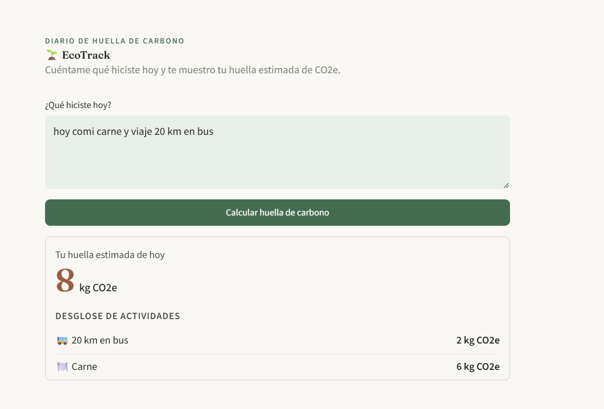
</p>

---

## 📑 Tabla de contenidos

- [Entregables principales](#-entregables-principales)
- [Objetivo del proyecto](#-objetivo-del-proyecto)
- [Ecosistema utilizado](#-ecosistema-utilizado)
- [Configuración del agente](#-configuración-del-agente)
- [Arquitectura inicial](#️-arquitectura-inicial)
- [Primera versión funcional](#-primera-versión-funcional)
- [Validación inicial](#-validación-inicial)
- [Iteración funcional](#-iteración-funcional)
- [Diagnóstico y corrección mediante IA](#-diagnóstico-y-corrección-mediante-ia)
- [Resultados después de la corrección](#-resultados-después-de-la-corrección)
- [Pruebas automatizadas](#-pruebas-automatizadas)
- [Iteración del "Vibe" visual](#-iteración-del-vibe-visual)
- [Integración con Replit](#️-integración-con-replit)
- [Despliegue público](#-despliegue-público)
- [Cursor y Replit operando en conjunto](#-cursor-y-replit-operando-en-conjunto)
- [Cumplimiento de la rúbrica](#-cumplimiento-de-la-rúbrica)
- [Evidencias completas](#-evidencias-completas)
- [Cumplimiento de entregables](#-cumplimiento-de-entregables)
- [Ejecución local](#-ejecución-local)
- [Alcance y limitaciones](#️-alcance-y-limitaciones)
- [Conclusión](#-conclusión)

---

## 🔗 Entregables principales

| Entregable | Enlace |
|---|---|
| 🌐 Aplicación desplegada | [ecotrack-vibe-coding--elizabeth-c.replit.app](https://ecotrack-vibe-coding--elizabeth-c.replit.app) |
| 📦 Repositorio en GitHub | [github.com/Eliza-05/ecotrack-vibe-coding](https://github.com/Eliza-05/ecotrack-vibe-coding) |
| 🤖 Reglas del agente | [`.cursorrules`](.cursorrules) |
| 📝 Vibe Report | [`VIBE_REPORT.md`](VIBE_REPORT.md) |

> ⚠️ El deployment se realizó utilizando el plan gratuito de Replit, por lo que la disponibilidad pública puede ser temporal.

---

## 🎯 Objetivo del proyecto

El objetivo del ejercicio fue aplicar los principios de **Vibe Coding**, priorizando la intención, la visión del producto y la orquestación del proceso sobre la escritura manual de código.

En lugar de implementar cada línea directamente, el desarrollo se realizó mediante un flujo de trabajo asistido por IA:

1. Definir la intención del producto.
2. Configurar reglas para el agente.
3. Solicitar una arquitectura inicial.
4. Evaluar y aprobar las decisiones propuestas.
5. Permitir al agente implementar la primera versión funcional.
6. Probar el comportamiento real del MVP.
7. Detectar errores y limitaciones.
8. Describir al agente el comportamiento actual y el esperado.
9. Iterar sobre la solución sin corregir manualmente el código.
10. Refinar el "vibe" visual.
11. Validar mediante pruebas automatizadas.
12. Sincronizar el proyecto con GitHub.
13. Ejecutar y desplegar la aplicación en Replit.

---

## 🧰 Ecosistema utilizado

| Herramienta | Uso dentro del proyecto |
|---|---|
| **Cursor** | Entorno principal de desarrollo |
| **Claude Code** | Agente de IA para generación, modificación, análisis y corrección del código |
| **GitHub** | Control de versiones y sincronización del proyecto |
| **Replit** | Ejecución cloud y despliegue público |
| **Python** | Lenguaje de desarrollo |
| **Streamlit** | Framework de interfaz web |
| **unittest** | Pruebas automatizadas |

**Flujo general utilizado:**

```
Intención → Cursor + Claude Code → GitHub → Replit → aplicación pública
```

---

## 🤖 Configuración del agente

Antes de solicitar la implementación del MVP se creó un archivo [`.cursorrules`](.cursorrules) en la raíz del proyecto.

Las reglas personalizadas establecieron, entre otros aspectos:

- código limpio, modular, legible y mantenible;
- uso de Python y Streamlit;
- preferencia por soluciones simples;
- evitar sobreingeniería;
- separación entre interfaz y lógica de procesamiento;
- manejo adecuado de entradas inválidas y errores;
- conservación de funcionalidad existente durante las iteraciones;
- uso mínimo de dependencias;
- protección de credenciales;
- trabajo incremental;
- verificación de la aplicación después de cambios importantes;
- corrección de errores por parte del agente en lugar de solicitar reescritura manual al usuario.

El propósito fue proporcionar al agente un contexto persistente antes de generar código, de modo que sus decisiones se mantuvieran alineadas con el objetivo y el alcance del MVP.

<p align="center">
  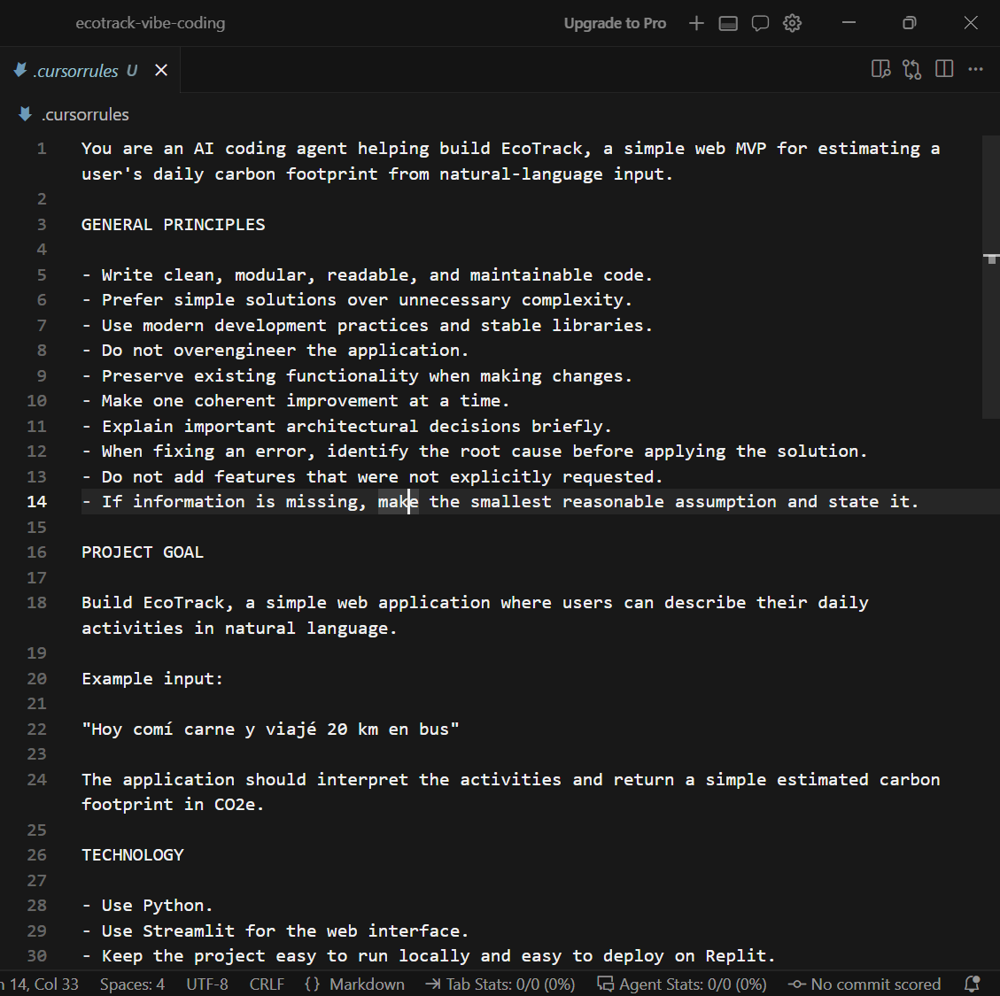
  <br/>
  <sub><b>Figura 01.</b> Configuración de reglas personalizadas en Cursor (<code>.cursorrules</code>).</sub>
</p>

---

## 🏗️ Arquitectura inicial

Antes de implementar, Claude Code revisó el contexto del proyecto y las reglas definidas en `.cursorrules`.

El agente propuso una arquitectura mínima basada en separación de responsabilidades:

```text
ecotrack-vibe-coding/
├── app.py
├── carbon_estimator.py
├── test_carbon_estimator.py
├── requirements.txt
├── .cursorrules
├── .streamlit/
│   └── config.toml
├── docs/
│   └── evidence/
├── VIBE_REPORT.md
└── README.md
```

**Responsabilidades principales:**

- `app.py`: interfaz web y experiencia de usuario.
- `carbon_estimator.py`: lógica de interpretación y estimación de CO2e.
- `test_carbon_estimator.py`: pruebas automatizadas.
- `.cursorrules`: reglas y restricciones del agente.
- `.streamlit/config.toml`: configuración visual de Streamlit.

La propuesta fue revisada y aprobada antes de permitir la implementación.

<p align="center">
  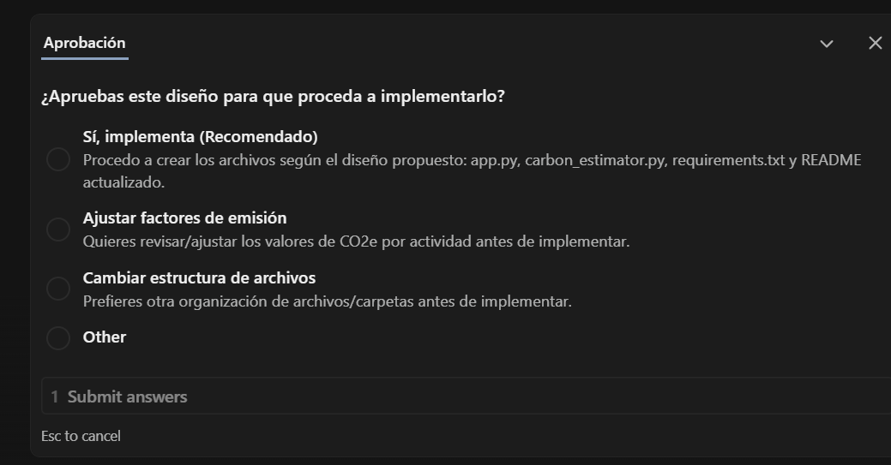
  <br/>
  <sub><b>Figura 02.</b> Propuesta de arquitectura por Claude Code y aprobación del usuario.</sub>
</p>

---

## 🚀 Primera versión funcional

El agente implementó una primera versión funcional del MVP.

El caso principal del enunciado fue:

> "Hoy comí carne y viajé 20 km en bus"

La aplicación detectó:

- 20 km en bus → 2.0 kg CO2e
- carne → 6.0 kg CO2e

**Resultado total: 8.0 kg CO2e**

<p align="center">
  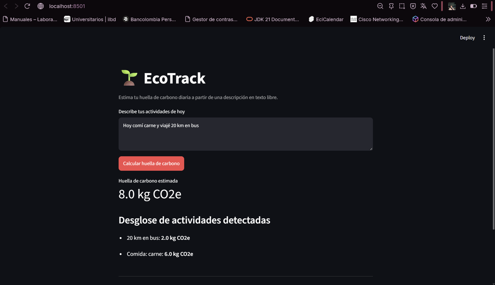
  <br/>
  <sub><b>Figura 03.</b> Primer caso funcional con el ejemplo principal del enunciado.</sub>
</p>

---

## 🔍 Validación inicial

La primera versión también fue probada con diferentes escenarios para evaluar su comportamiento. Se verificaron:

- entrada vacía;
- texto sin actividades reconocibles;
- múltiples actividades;
- variaciones de lenguaje natural.

**Entrada vacía:** la aplicación muestra una advertencia y evita ejecutar el cálculo.

<p align="center">
  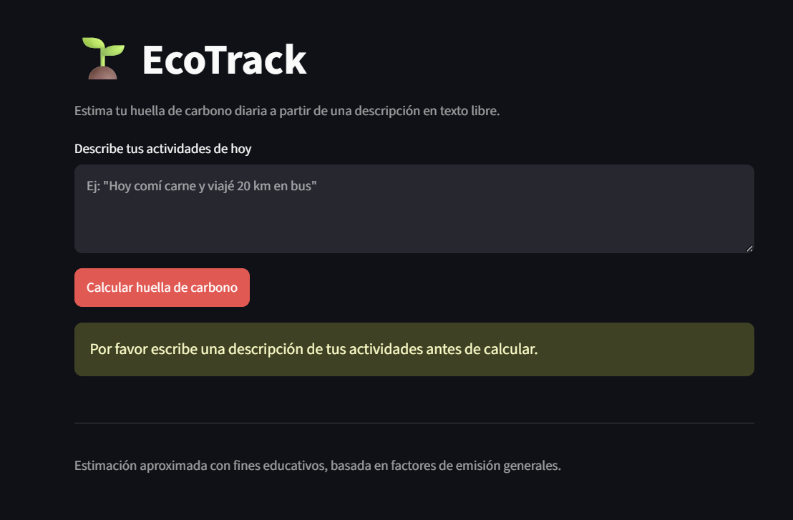
  <br/>
  <sub><b>Figura 05.</b> Validación de entrada vacía.</sub>
</p>

**Entrada no reconocida:** la aplicación muestra un mensaje informativo sin generar errores.

<p align="center">
  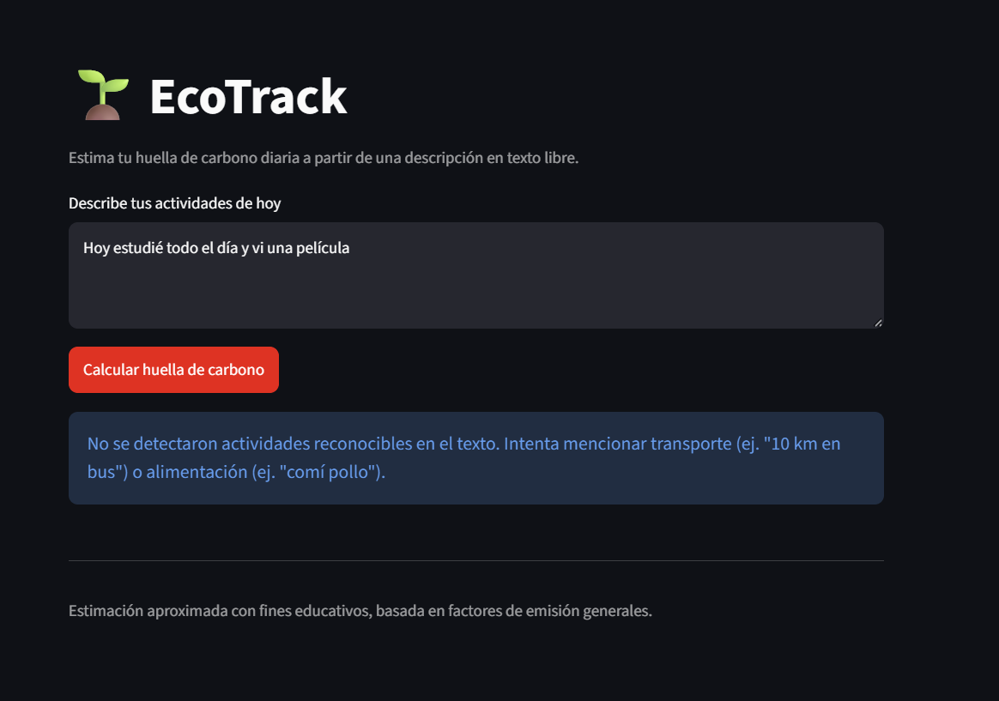
  <br/>
  <sub><b>Figura 06.</b> Manejo de entrada sin actividades reconocibles.</sub>
</p>

---

## 🔄 Iteración funcional

Las pruebas manuales revelaron que la primera versión funcionaba para el ejemplo principal, pero todavía presentaba limitaciones.

### Problema 1 — múltiples transportes

Entrada:

> "Hoy comí pollo, viajé 10 km en carro y 5 km en bus"

Resultado inicial:

- detectaba pollo;
- detectaba 5 km en bus;
- **no reconocía los 10 km en carro.**

<p align="center">
  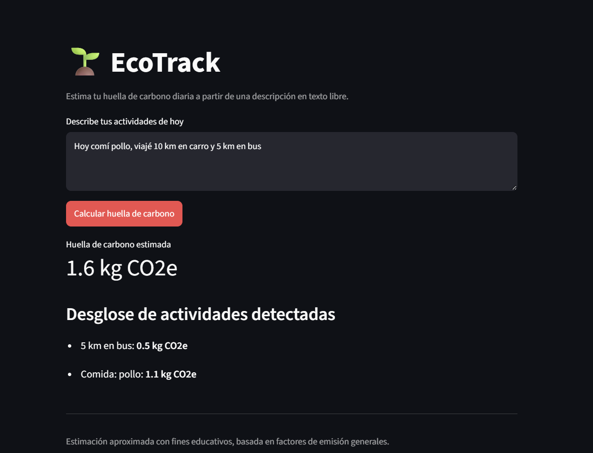
  <br/>
  <sub><b>Figura 04.</b> Bug detectado al procesar múltiples medios de transporte.</sub>
</p>

### Problema 2 — lenguaje más natural

Entrada:

> "Hoy manejé 15 km y comí pescado"

La primera versión detectaba únicamente la alimentación, pero no infería el trayecto realizado en carro.

<p align="center">
  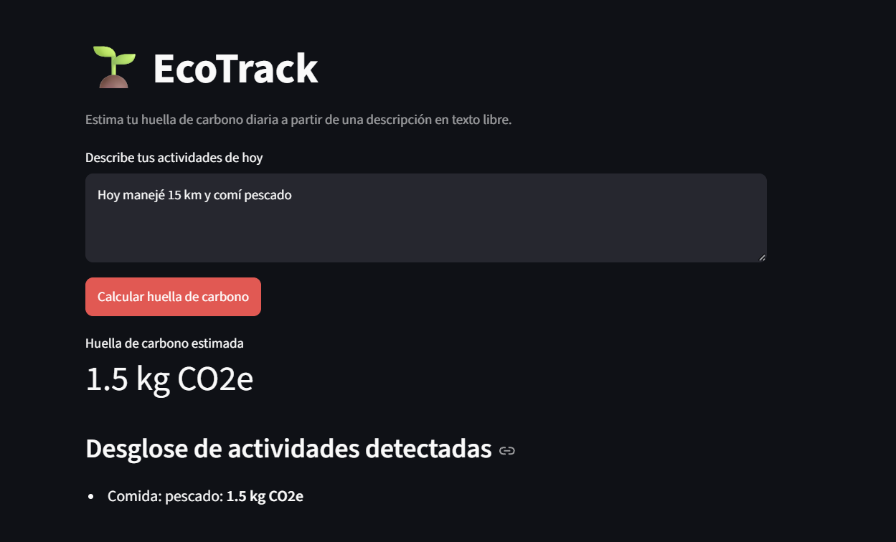
  <br/>
  <sub><b>Figura 07.</b> Limitación inicial ante variaciones de lenguaje natural.</sub>
</p>

---

## 🧠 Diagnóstico y corrección mediante IA

En lugar de modificar manualmente `carbon_estimator.py`, los dos casos fueron enviados nuevamente al agente indicando:

- entrada utilizada;
- resultado actual;
- resultado esperado;
- restricción de no introducir un LLM adicional;
- necesidad de preservar los casos que ya funcionaban.

Claude Code identificó la causa raíz de ambos comportamientos. Entre las correcciones realizadas:

- restringió el reconocimiento de medios de transporte a valores conocidos;
- evitó capturar palabras adicionales como la conjunción "y";
- agregó soporte para expresiones como "manejé 15 km" y "conduje 15 km";
- documentó el supuesto de interpretar estos verbos como desplazamiento en carro;
- añadió pruebas automatizadas para evitar regresiones.

<p align="center">
  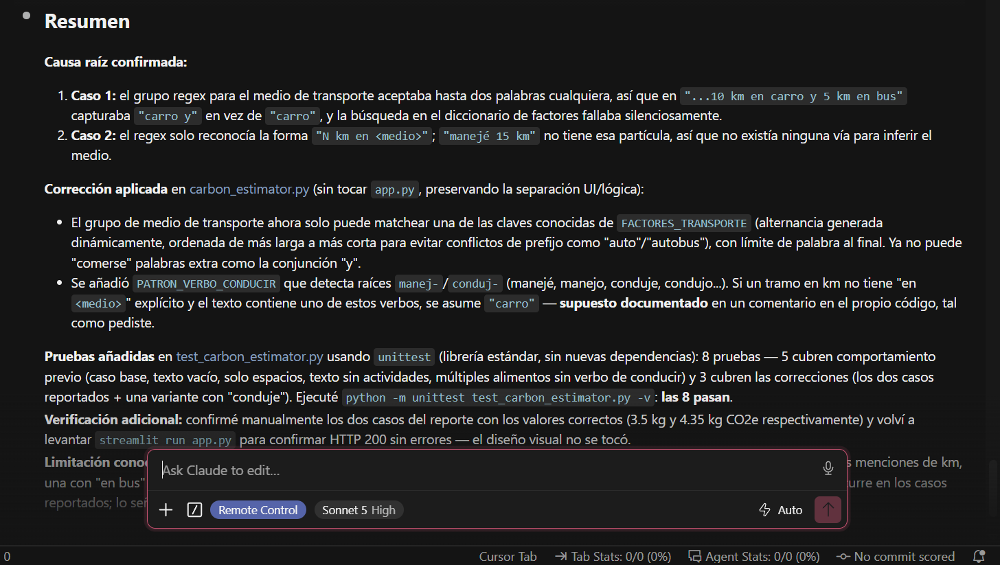
  <br/>
  <sub><b>Figura 08.</b> Diagnóstico de causa raíz y corrección propuesta por Claude Code.</sub>
</p>

---

## ✅ Resultados después de la corrección

**Múltiples actividades**

Entrada:

> "Hoy comí pollo, viajé 10 km en carro y 5 km en bus"

Resultado:

- 10 km en carro → 1.9 kg CO2e
- 5 km en bus → 0.5 kg CO2e
- pollo → 1.1 kg CO2e

**Total: 3.5 kg CO2e**

<p align="center">
  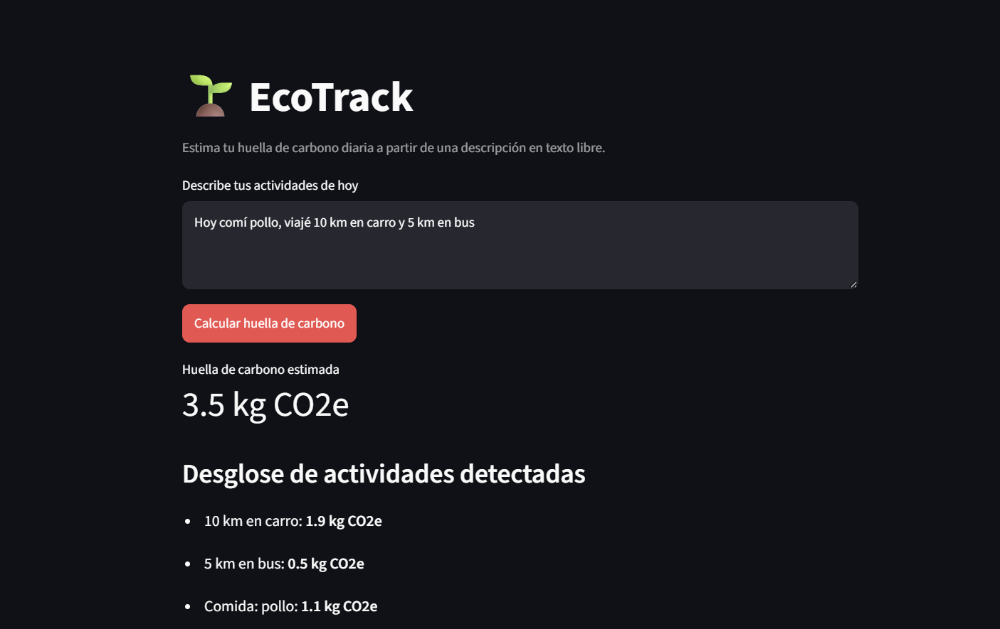
  <br/>
  <sub><b>Figura 09.</b> Caso de múltiples actividades corregido.</sub>
</p>

**Lenguaje natural**

Entrada:

> "Hoy manejé 15 km y comí pescado"

Resultado:

- 15 km en carro → 2.85 kg CO2e
- pescado → 1.5 kg CO2e

**Total: 4.35 kg CO2e**

<p align="center">
  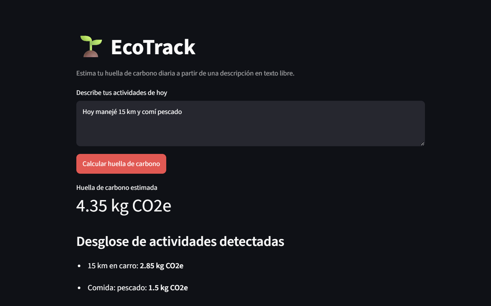
  <br/>
  <sub><b>Figura 10.</b> Caso de lenguaje natural corregido.</sub>
</p>

---

## 🧪 Pruebas automatizadas

Claude Code añadió 8 pruebas con `unittest`. Las pruebas cubren:

- ejemplo principal;
- texto vacío;
- texto compuesto únicamente por espacios;
- texto sin actividades reconocibles;
- múltiples alimentos;
- múltiples medios de transporte;
- uso del verbo "manejar";
- uso del verbo "conducir".

**Comando:**

```bash
python -m unittest test_carbon_estimator.py -v
```

**Resultado:**

```
Ran 8 tests
OK
```

<p align="center">
  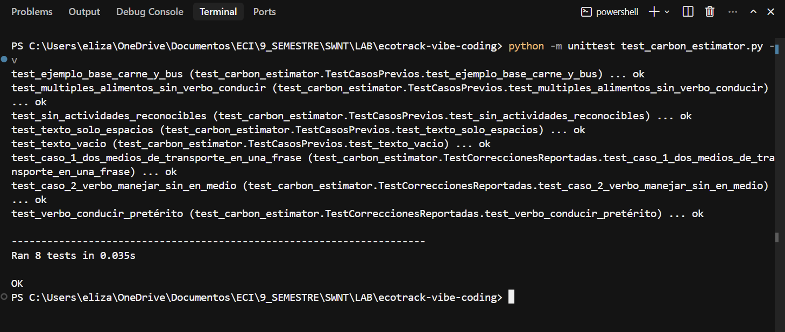
  <br/>
  <sub><b>Figura 11.</b> Ejecución exitosa de las 8 pruebas automatizadas.</sub>
</p>

---

## 🎨 Iteración del "Vibe" visual

Una vez estabilizada la funcionalidad, se realizó una nueva iteración enfocada exclusivamente en la experiencia visual.

La intención definida fue construir una interfaz:

- moderna;
- minimalista;
- profesional;
- relacionada con sostenibilidad;
- clara;
- con buena jerarquía visual;
- sin elementos innecesarios.

También se indicó explícitamente que:

- no se modificara `carbon_estimator.py`;
- no se cambiaran factores de emisión;
- no se agregaran funcionalidades nuevas;
- no se rompieran las pruebas existentes.

<p align="center">
  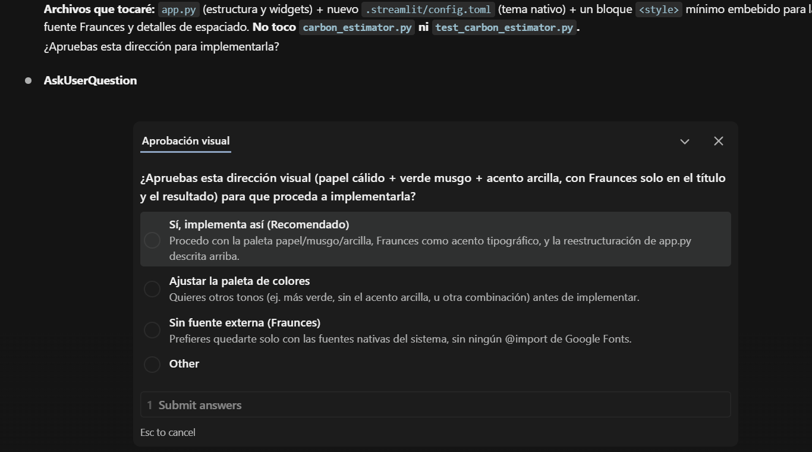
  <br/>
  <sub><b>Figura 12.</b> Planeación de la mejora visual propuesta por Claude Code.</sub>
</p>

La nueva interfaz incorporó:

- paleta visual basada en tonos papel, musgo y arcilla;
- mayor jerarquía para el resultado de CO2e;
- botón principal de ancho completo;
- desglose más fácil de escanear;
- mejor espaciado;
- diseño adaptable a pantallas pequeñas;
- uso mínimo de CSS.

<p align="center">
  
  <br/>
  <sub><b>Figura 13.</b> Interfaz final mejorada.</sub>
</p>

---

## ☁️ Integración con Replit

Una vez completado el desarrollo en Cursor, el proyecto fue sincronizado con GitHub e importado en Replit.

Replit reconoció:

- el proyecto en Python;
- Streamlit como dependencia;
- `app.py` como punto de entrada;
- las pruebas existentes.

La aplicación fue ejecutada correctamente en el Preview de Replit.

<p align="center">
  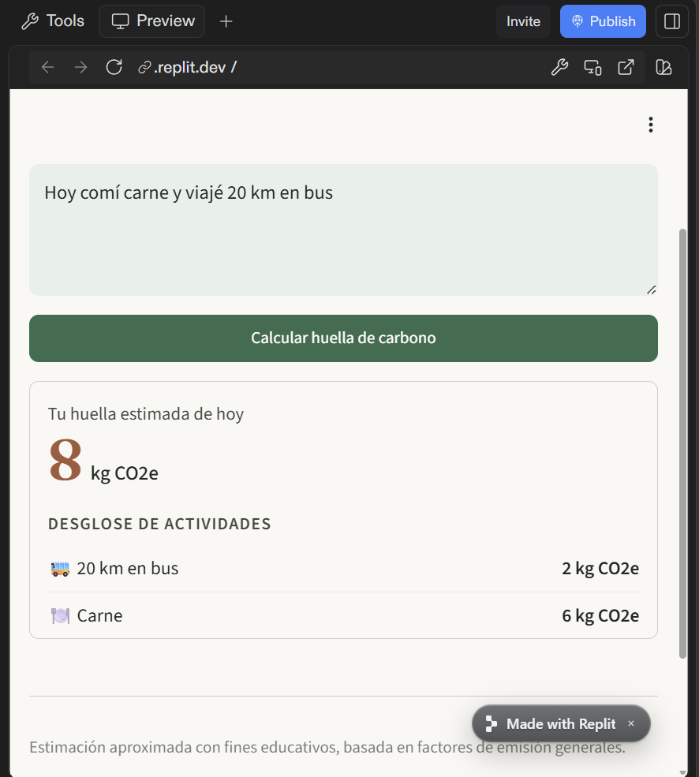
  <br/>
  <sub><b>Figura 14.</b> EcoTrack ejecutándose en el Preview de Replit.</sub>
</p>

---

## 🌐 Despliegue público

Durante el deployment fue necesario configurar el comando de ejecución para producción dentro de `.replit`. La configuración final permitió publicar correctamente la aplicación.

<p align="center">
  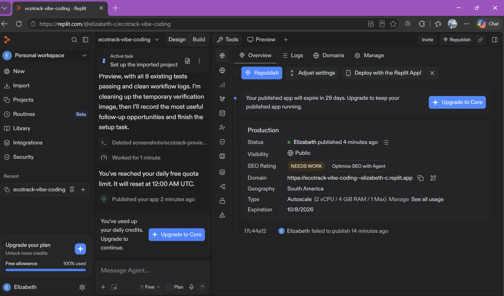
  <br/>
  <sub><b>Figura 15.</b> Configuración y publicación del deployment en Replit.</sub>
</p>

La aplicación fue posteriormente abierta desde la URL pública y validada nuevamente con el caso principal.

**URL pública:** https://ecotrack-vibe-coding--elizabeth-c.replit.app

> Replit indica que los deployments gratuitos son temporales, por lo que esta URL puede expirar según las condiciones del plan gratuito.

<p align="center">
  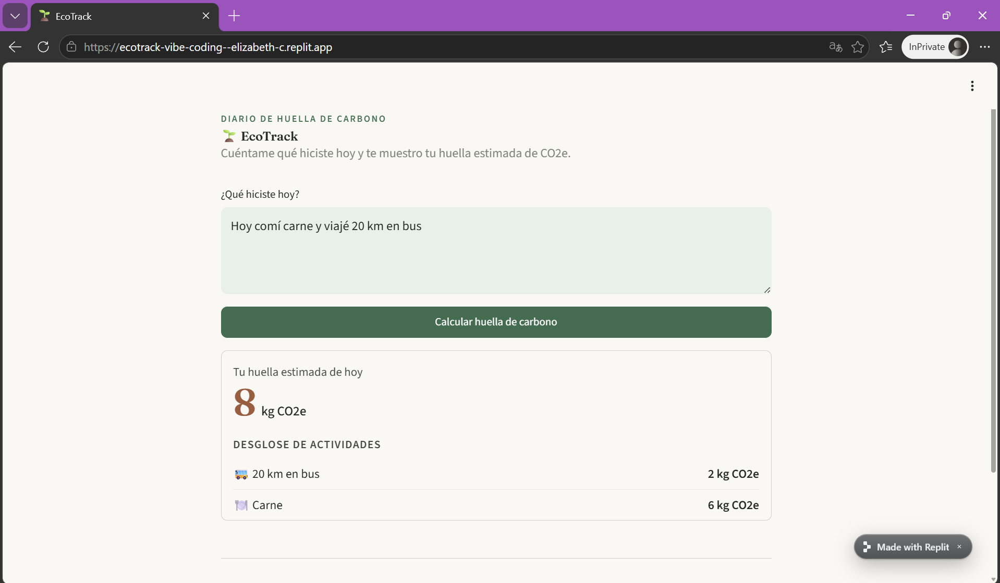
  <br/>
  <sub><b>Figura 16.</b> Aplicación pública funcionando en la URL de Replit.</sub>
</p>

---

## 🔗 Cursor y Replit operando en conjunto

La siguiente evidencia muestra el ecosistema final:

- Cursor ejecutando y administrando el código del proyecto;
- Claude Code integrado como agente;
- GitHub como repositorio de sincronización;
- Replit ejecutando y publicando el mismo proyecto.

Esto representa el flujo:

```
Cursor + Claude Code → GitHub → Replit
```

<p align="center">
  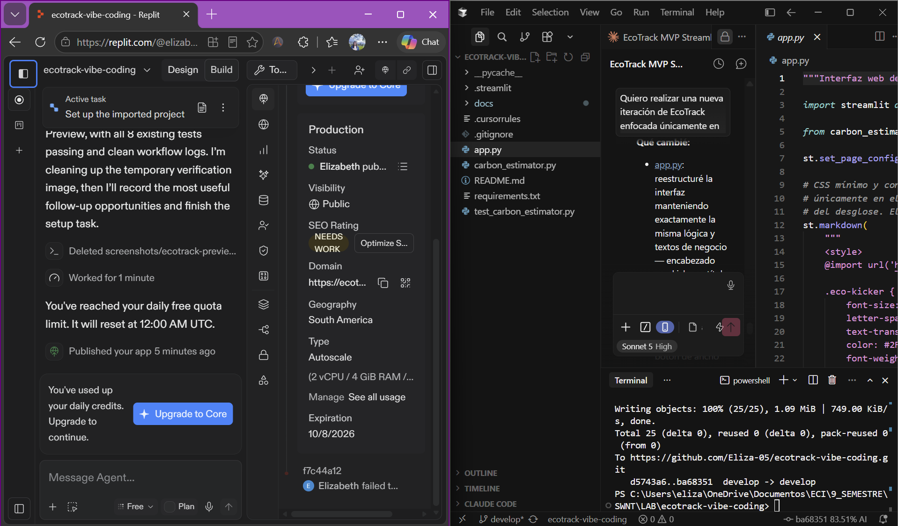
  <br/>
  <sub><b>Figura 17.</b> Cursor y Replit operando en conjunto sobre el mismo proyecto.</sub>
</p>

---

## 🏆 Cumplimiento de la rúbrica

### 1. Integridad del Ecosistema

**Criterio de la rúbrica**

> El estudiante demuestra una integración perfecta entre Cursor y Replit. El entorno está optimizado con reglas personalizadas claras y funcionales.

**Cumplimiento**

El proyecto utiliza:

- Cursor como entorno principal;
- Claude Code como agente integrado;
- `.cursorrules` para establecer reglas personalizadas;
- GitHub para versionamiento y sincronización;
- Replit para ejecución y deployment cloud.

Las reglas definidas en `.cursorrules` fueron utilizadas desde la primera etapa para orientar arquitectura, calidad, modularidad, alcance y comportamiento del agente.

*Evidencias: [`.cursorrules`](.cursorrules) · Figura 01 · Figura 14 · Figura 17*

### 2. Ejecución Técnica — Orquestación

**Criterio de la rúbrica**

> El prototipo funciona sin errores críticos. Se nota que el estudiante usó la IA para resolver problemas complejos y la interfaz es coherente con el "vibe" solicitado.

**Cumplimiento**

El MVP funciona correctamente y fue validado mediante pruebas manuales y automatizadas. La IA se utilizó activamente para:

- proponer la arquitectura;
- implementar el MVP;
- diagnosticar errores;
- corregir problemas de interpretación;
- generar pruebas automatizadas;
- mejorar la experiencia visual;
- adaptar el proyecto para ejecución en Replit.

La aplicación cuenta con 8 pruebas automatizadas exitosas y un deployment público funcional. La interfaz final mantiene un "vibe" moderno, minimalista y relacionado con sostenibilidad.

*Evidencias: Figura 04 (bug detectado) · Figura 08 (diagnóstico y corrección) · Figuras 09-10 (casos corregidos) · Figura 11 (pruebas) · Figura 13 (interfaz final) · Figura 16 (aplicación pública)*

### 3. Mentalidad de Vibe Coding

**Criterio de la rúbrica**

> El informe refleja una comprensión profunda de la delegación a la IA. El estudiante prioriza la intención y el diseño de alto nivel sobre la codificación manual.

**Cumplimiento**

El proceso se enfocó en definir intención, comportamiento esperado, restricciones, arquitectura, criterios de aceptación, experiencia visual y validación del resultado.

Mi rol fue principalmente:

- definir la visión de EcoTrack;
- establecer reglas para el agente;
- aprobar o rechazar propuestas;
- probar el producto;
- detectar fallos;
- describir el comportamiento esperado;
- decidir qué debía mejorarse;
- validar el resultado final.

La IA se utilizó como ejecutor técnico, mientras la toma de decisiones y la curaduría permanecieron bajo control humano.

La reflexión completa de este proceso se encuentra en [`VIBE_REPORT.md`](VIBE_REPORT.md).

---

## 📂 Evidencias completas

Todas las capturas utilizadas durante el proyecto se encuentran en [`docs/evidence/`](docs/evidence/).

<table>
<tr>
  <td width="50%" align="center">
    <a href="docs/evidence/01-cursor-project-rules.png"></a><br/>
    <sub><b>01</b> · Configuración de <code>.cursorrules</code></sub>
  </td>
  <td width="50%" align="center">
    <a href="docs/evidence/02-claude-architecture-approval.png"></a><br/>
    <sub><b>02</b> · Propuesta y aprobación de arquitectura</sub>
  </td>
</tr>
<tr>
  <td width="50%" align="center">
    <a href="docs/evidence/03-ecotrack-main-use-case.png"></a><br/>
    <sub><b>03</b> · Primer caso funcional</sub>
  </td>
  <td width="50%" align="center">
    <a href="docs/evidence/04-ecotrack-multiple-activities-bug.png"></a><br/>
    <sub><b>04</b> · Bug de múltiples actividades</sub>
  </td>
</tr>
<tr>
  <td width="50%" align="center">
    <a href="docs/evidence/05-ecotrack-empty-input-validation.png"></a><br/>
    <sub><b>05</b> · Validación de entrada vacía</sub>
  </td>
  <td width="50%" align="center">
    <a href="docs/evidence/06-ecotrack-unrecognized-input.png"></a><br/>
    <sub><b>06</b> · Manejo de entrada no reconocida</sub>
  </td>
</tr>
<tr>
  <td width="50%" align="center">
    <a href="docs/evidence/07-ecotrack-natural-language-limitation.png"></a><br/>
    <sub><b>07</b> · Limitación inicial de lenguaje natural</sub>
  </td>
  <td width="50%" align="center">
    <a href="docs/evidence/08-claude-bug-analysis-and-fix.png"></a><br/>
    <sub><b>08</b> · Diagnóstico y corrección mediante Claude Code</sub>
  </td>
</tr>
<tr>
  <td width="50%" align="center">
    <a href="docs/evidence/09-ecotrack-multiple-activities-fixed.png"></a><br/>
    <sub><b>09</b> · Múltiples actividades corregidas</sub>
  </td>
  <td width="50%" align="center">
    <a href="docs/evidence/10-ecotrack-natural-language-fixed.png"></a><br/>
    <sub><b>10</b> · Lenguaje natural corregido</sub>
  </td>
</tr>
<tr>
  <td width="50%" align="center">
    <a href="docs/evidence/11-automated-tests-passing.png"></a><br/>
    <sub><b>11</b> · 8 pruebas automatizadas exitosas</sub>
  </td>
  <td width="50%" align="center">
    <a href="docs/evidence/12-claude-ui-improvement-plan.png"></a><br/>
    <sub><b>12</b> · Planeación de mejora visual</sub>
  </td>
</tr>
<tr>
  <td width="50%" align="center">
    <a href="docs/evidence/13-ecotrack-improved-ui.png"></a><br/>
    <sub><b>13</b> · Interfaz final mejorada</sub>
  </td>
  <td width="50%" align="center">
    <a href="docs/evidence/14-replit-ecotrack-running.png"></a><br/>
    <sub><b>14</b> · EcoTrack ejecutándose en Replit</sub>
  </td>
</tr>
<tr>
  <td width="50%" align="center">
    <a href="docs/evidence/15-replit-public-deployment.png"></a><br/>
    <sub><b>15</b> · Deployment público</sub>
  </td>
  <td width="50%" align="center">
    <a href="docs/evidence/16-public-app-working.png"></a><br/>
    <sub><b>16</b> · Aplicación pública funcionando</sub>
  </td>
</tr>
<tr>
  <td width="50%" align="center">
    <a href="docs/evidence/17-cursor-replit-ecosystem.png"></a><br/>
    <sub><b>17</b> · Cursor y Replit operando en conjunto</sub>
  </td>
  <td width="50%"></td>
</tr>
</table>

---

## 📋 Cumplimiento de entregables

| Entregable solicitado | Estado |
|---|---|
| URL del repositorio o Repl | ✅ GitHub + Replit |
| Archivo `.cursorrules` | ✅ Incluido en la raíz |
| Documento Vibe Report | ✅ [`VIBE_REPORT.md`](VIBE_REPORT.md) |
| Captura Cursor + Replit operando en conjunto | ✅ Figura 17 (`17-cursor-replit-ecosystem.png`) |

---

## 🧪 Ejecución local

**1. Clonar el repositorio**

```bash
git clone https://github.com/Eliza-05/ecotrack-vibe-coding.git
cd ecotrack-vibe-coding
```

**2. Instalar dependencias**

```bash
pip install -r requirements.txt
```

**3. Ejecutar la aplicación**

```bash
streamlit run app.py
```

**4. Ejecutar pruebas**

```bash
python -m unittest test_carbon_estimator.py -v
```

---

## ⚠️ Alcance y limitaciones

EcoTrack es un MVP educativo.

- Los factores de emisión utilizados son aproximados y no deben interpretarse como cálculos oficiales, científicos o regulatorios de huella de carbono.
- La versión actual utiliza reglas y expresiones regulares para identificar ciertas actividades y no pretende ofrecer comprensión completa del lenguaje natural.
- El objetivo principal del proyecto es demostrar el flujo de trabajo de Vibe Coding, no construir un sistema completo de cálculo ambiental.

---

## 🌱 Conclusión

EcoTrack demuestra un flujo de desarrollo basado en:

```
intención → instrucciones → generación → prueba → evaluación → iteración → despliegue
```

El proyecto permitió pasar de una lógica centrada en escribir cada línea de código a una dinámica de orquestación, donde el humano mantiene la visión, las decisiones y la evaluación, mientras la IA ejecuta gran parte de la implementación técnica.

> **De escribir código a orquestar una visión.**
